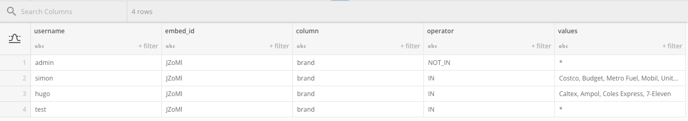

# Domo Everywhere Embedded Analytics Demo

This example is derived from Domo's public `node.js` [example](https://github.com/domoinc/domo-node-embed-filters). The aim of this project is to demonstrating programmatic authentication against a dataset imported into Domo, rather than using the hardcoded `users.js` module, which is unrealistic for most Domo Everywhere deployments in production. This should demonstrate how embedding can be integrated in an existing authentication workflow.

## Prerequisites

1. Install `node.js`, you can find download and instructions [here](https://nodejs.org/en/download)
2. Once `node.js` has been installed, using the `npm` package manager install `yarn` by following [these instructions](https://classic.yarnpkg.com/lang/en/docs/install/#mac-stable)
3. Create an API client against the instance being developed on from the [Domo Developer Portal](https://developer.domo.com/portal/d01f63a6ba662-domo-developer-portal)
   - The minimum scope required for the client is `data, audit, user, dashboard`

## Setup

1. If you have not created a dashboard or card to embed, create one in your Domo environment
2. Embed the dashboard or card using the 'Private' embed option
   - In the popup modal, copy the `Embed ID` which should be an alphanumeric code with 5 characters in 'Additional information'
   - Alternatively, you can find this embed code from the Admin Settings -> Domo Everywhere -> Embed page, navigating to either the 'Cards' or 'Dashboards' tab to find the embeddable content and it's ID

3. Create a dataset with the desired permissions. The schema should be `username`, `embed_id`, `column`, `operator` and `values`. If you wish to change this, you will need to change the `userService.js` file. Creating an admin user with a wildcard value such as `region` `NOT_IN` `*` can be helpful, as well as including a count of column filter values as `value_counts` to show the number of values a certain user has access to
   - `username` is the username logging into the demo portal
   - `embed_id`is the embed ID of the content being embedded
   - `column` is the column that will be used to filter the embedded content
   - `operator` will specify how the filter values will be handled
     - Valid options are: "IN", "NOT_IN", "EQUALS", "NOT_EQUALS", "GREATER_THAN", "GREAT_THAN_EQUALS_TO", "LESS_THAN", "LESS_THAN_EQUALS_TO"
   - `values` is a string of comma separated values that will be filtered

4. Create the `.env` environmental file in the home directory of the project with the following information:
   - `CLIENT_ID` is the client ID created from the developer portal
   - `CLIENT_SECRET` is the client secret created from the developer portal
   - `EMBED_ID` is the embed ID of the content
   - `EMBED_TYPE` is either `dashboard` or `card` (without quotes)
   - `AUTH_DATASET_ID` is the ID of the dataset created earlier that will handle the access control to the embedded content

## Running the Server

1. In the home directory of the project run `yarn` to install the projects dependencies
2. Run `yarn start` which will run the start script once the dependencies have been installed to run a server on `localhost:3001`/ `127.0.0.1:3001`
   - To specify a different run with the `-p` flag: `yarn start -p 8080`
3. Navigate to `localhost:3001`/ `127.0.0.1:3001` (or the custom port specified earlier) and log in using a username listed in the authentication dataset and ANY password. Password authentication has not yet been added and is unnecessary for demonstration purposes

## Common Issues

- If your dataset has a one to one mapping for users to the filter values that need to be combined into a single value, create a dataflow where you can use the `Group By` MagicETL tile and aggregate the values using the `Combined by strings separated by ,` option. This may cause more issues downstream if the list of filter values is large due to size constraints of Domo column fields as well as browser implemented JWT size limits (8kb). A workaround could be to create an abstracted column in the dataset as a group of values. For example, rather than exhaustively listing every single country in the Asia Pacific region, an `APAC` region could be created and applied as the new filter column value.
- Ensure that the schema of the authentication dataset is exactly as written. If not, values for the validated user object may not populate correctly and the dashboard will not render correctly
- Ensure that the value for `values` is a single string surrounded by quotes. In Domo, this will look like a column as a text data type, with no visible quotes around the string
- Ensure the scope for the API client is correct

## TODO

- [x] Change authentication method to be programmatic
- [x] Refactor project structure to separate concerns (in progress)
- [ ] Add unit tests with 100% coverage (in progress)
- [ ] Add an SSO example, demonstrating a user logging in as a named Domo user
- [ ] Add password authentication

## Support

- This project utilised information documented on the [Domo Developer Portal](https://developer.domo.com/) including relevant API documentation and Domo Everywhere documentation
- This project is not regularly maintained. [Domo Central](https://www.domo.com/domo-central) is the best place to go for any specific questions, although please feel free to reach out with any questions or feedback!
